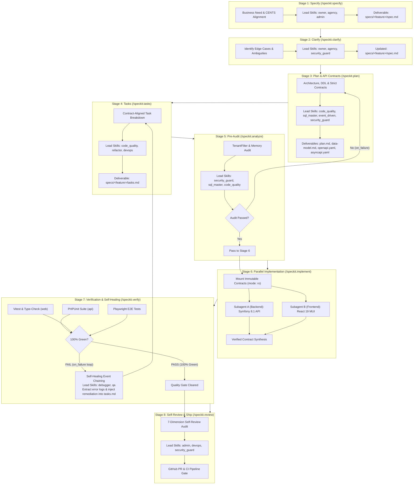
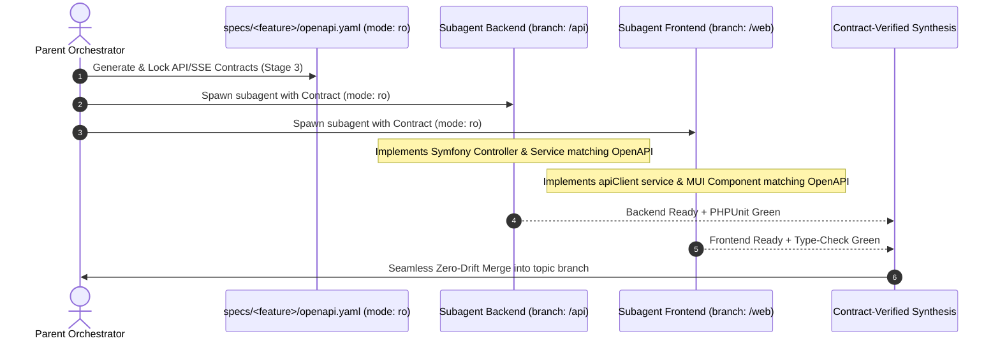
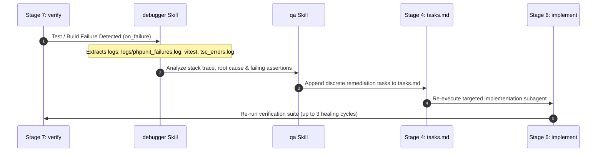

# Workflow: Spec-Driven Development (SDD) Multi-Agent Pipeline

## Purpose
Enforce a disciplined, autonomous, and **self-healing** **Spec-Driven Development (SDD)** lifecycle across the Idumela platform. SDD decouples architectural decision-making, strict API contract generation, security pre-audits, parallel subagent code implementation, automated quality verification, and self-healing diagnostic loops into an 8-stage pipeline powered by the full suite of specialized AI agent skills.

---

## SDD Multi-Agent Architecture Blueprint



---

## 🔒 Strict API Contract Enforcement (Zero-Drift Strategy)

To allow backend (Symfony 8.1) and frontend (React MUI) subagents to develop independently in isolated parallel workspaces without integration drift, **Stage 3 (`plan`) generates immutable contract specifications**:

1. **REST API Contract (`specs/<feature-name>/openapi.yaml`)**:
   - Exact endpoint paths, query parameters, request bodies, and HTTP status codes.
   - Standard envelope payload structure: `{"status": string, "message": string, "data": mixed}`.
   - Multi-tenant headers: `X-Brand-Id`, `X-Locale`.

2. **Real-Time Event Contract (`specs/<feature-name>/asyncapi.yaml`)**:
   - Mercure SSE topic paths (`/api/brands/{id}`, `/api/prospects/{id}`).
   - Event schemas: `SYNC_COMPLETE`, `PROSPECT_UPDATED`, `REVIEW_UPDATED`, `CRISIS_ALERT`.
   - Standard notification envelope: `{"type": string, "title": string, "message": string, "timestamp": string, "metadata": array}`.



---

## 🩹 Automated Self-Healing Loop (`on_failure` Event Chaining)

When automated test suites (PHPUnit, Vitest, Playwright, or TypeScript compiler) fail in Stage 7 (`verify`), the pipeline triggers a self-healing diagnostic loop instead of terminating:



### Self-Healing Guardrails:
- **Maximum Healing Cycles:** Capped at `max_healing_iterations: 3` to prevent infinite loops.
- **Diagnostic Context Injection:** Error logs (`phpunit_failures.log`, `vitest_failures.log`, Playwright traces, `tsc` errors) are automatically bundled into the subagent's remediation prompt.
- **Empirical Proof:** No task is declared complete until all checks return 100% green exit code 0.

---

## The 8 Stages of the SDD Pipeline

### Stage 1: Business & Domain Specification (`/speckit.specify`)
- **Objective:** Define **WHAT** to build and **WHY** without technology coupling.
- **Lead Skills:** `owner`, `agency`, `admin`
- **Actions:**
  1. Create directory `specs/<feature-name>/`.
  2. Validate feature against CENTS framework (Control, Entry, Need, Time, Scale).
  3. Write `specs/<feature-name>/spec.md` with:
     - Business Motivation & Target Personas (Admin / Agency / Owner).
     - User Stories & Primary Workflows.
     - Functional & Non-Functional Requirements.
     - Out of Scope Guardrails.

### Stage 2: Requirements Clarification (`/speckit.clarify`)
- **Objective:** Eliminate ambiguities and edge cases early before architecture design.
- **Lead Skills:** `owner`, `agency`, `security_guard`
- **Actions:**
  1. Audit `spec.md` for underspecified requirements (e.g. rate limits, multi-tenant permission boundaries, billing limits).
  2. Solicit clarifications and record resolutions directly into `specs/<feature-name>/spec.md`.

### Stage 3: Technical Planning & Strict Contract Generation (`/speckit.plan`)
- **Objective:** Design **HOW** to build the feature following Idumela's core architecture rules and lock API contracts.
- **Lead Skills:** `code_quality`, `sql_master`, `event_driven`, `security_guard`
- **Deliverables:**
  1. `specs/<feature-name>/plan.md`: 3-Layer architecture (Controllers $\rightarrow$ Services $\rightarrow$ Repositories), Messenger async queues, Mercure SSE topics.
  2. `specs/<feature-name>/data-model.md`: Doctrine ORM entities, attributes, additive migrations, `TenantFilter` isolation.
  3. `specs/<feature-name>/openapi.yaml`: Immutable REST API schema (request/response envelopes, query params, headers).
  4. `specs/<feature-name>/asyncapi.yaml`: Immutable Mercure SSE real-time topic definitions.
  5. `specs/<feature-name>/research.md`: Plugin architecture (`AddonInterface`) and technical trade-offs.

### Stage 4: Dependency-Aware Task Decomposition (`/speckit.tasks`)
- **Objective:** Break down the plan into ordered, atomic, testable work units aligned with the API contract.
- **Lead Skills:** `code_quality`, `refactor`, `devops`
- **Actions:**
  1. Write `specs/<feature-name>/tasks.md` structured sequentially:
     - **Phase 1:** Database Schema & Additive Migration (`bin/console doctrine:migrations:migrate -n`).
     - **Phase 2:** Backend Domain Services, Events & Messenger Async Handlers.
     - **Phase 3:** Thin REST API Controllers & OpenAPI Route Alignment.
     - **Phase 4:** Frontend MUI Components, Optimistic Conveyor Belt UX, and Dynamic Tabs (`AddonTabRenderer.tsx`).
     - **Phase 5:** PHPUnit Backend & Vitest Frontend Unit/Integration Tests.
     - **Phase 6:** End-to-End Playwright Verification.
  2. Update `specs/DEPENDENCY_MAP.md` to register the new feature specification.

### Stage 5: Security & Tenancy Pre-Audit (`/speckit.analyze`)
- **Objective:** Defensively audit the implementation plan before code execution.
- **Lead Skills:** `security_guard`, `sql_master`, `code_quality`
- **Audit Checklist:**
  - [ ] Multi-tenant isolation verified (`TenantFilter` active, FrankenPHP worker state safe).
  - [ ] Defensive migrations (Additive DDL only, safe defaults, no `NOT NULL` without default on populated tables).
  - [ ] Technical obfuscation (No internal terms like `pgvector`, `Apify`, `ORM` in user-facing views).
  - [ ] Zero polling (Real-time updates strictly via Mercure SSE `EventSource`).
- **On Failure:** Re-routes to Stage 3 (`plan`) if security or tenancy boundaries are violated.

### Stage 6: Parallel Subagent Implementation (`/speckit.implement`)
- **Objective:** Execute implementation tasks concurrently using isolated subagents with read-only contract mounts.
- **Lead Skills:** `code_quality`, `pixel`, `event_driven`, `migrations`
- **Workspaces:**
  - `subagent_backend`: Isolated `branch` workspace pinned to `contract/openapi.yaml` (mode: `ro`).
  - `subagent_frontend`: Isolated `branch` workspace pinned to `contract/openapi.yaml` (mode: `ro`).
- **Contract-Verified Synthesis:** Parent orchestrator merges outputs and resolves registry integrations in `router.tsx`, `AddonTabRenderer.tsx`, and `services.yaml`.
- **On Failure:** Re-routes to Stage 6 (`implement`) with the `debugger` skill to fix compilation or AST merge conflicts.

### Stage 7: Empirical Quality & E2E Verification (`/speckit.verify`)
- **Objective:** Guarantee 100% green automated test execution and zero regression.
- **Lead Skills:** `qa`, `debugger`, `pixel`
- **Verification Commands:**
  ```bash
  # Frontend Type-Check & Linting
  cd web && npm run type-check && npm run lint

  # Backend PHPUnit Suite
  cd api && bin/phpunit

  # Skills Security & Syntax Validator
  node scripts/validate-skills.mjs
  ```
- **On Failure (Self-Healing Loop):** Intercepts test/build errors, invokes `debugger` & `qa` to generate targeted remediation tasks in `tasks.md`, and loops back to implementation (up to 3 cycles).

### Stage 8: Self-Review & Pull Request Gate (`/speckit.review`)
- **Objective:** Enforce zero-defect delivery and GitHub Actions CI gate compliance.
- **Lead Skills:** `admin`, `devops`, `security_guard`
- **Actions:**
  1. Execute the mandatory 7-dimension self-review from `.agents/rules/review.md`.
  2. Push topic branch to GitHub:
     ```bash
     git push -u origin <branch-name>
     ```
  3. Create/Update GitHub Pull Request with rich multi-section description.
  4. Post the completed 7-dimension Self-Review Audit as a PR comment:
     ```bash
     gh pr comment <pr_number> --body "<audit_report>"
     ```
  5. Confirm all GitHub Actions CI checks are 100% green before merge approval.

---

## Specialized Skills Alignment Matrix

| Skill | Category | Primary SDD Stage | Key Responsibilities |
| :--- | :--- | :--- | :--- |
| **`owner`** | Business Persona | Stage 1, Stage 2 | ROI evaluation, approval UX simplicity, CENTS compliance |
| **`agency`** | Business Persona | Stage 1, Stage 2 | Multi-brand governance, client onboarding, viral invitation loops |
| **`admin`** | Systems Persona | Stage 1, Stage 8 | Dynamic ACL roles, billing ledger, platform scalability |
| **`documentation`** | Spec-Kit Arch | Stage 1, Stage 3, Stage 8 | 8-artifact Spec-Kit lifecycle, Mermaid diagrams, AGENTS.md, README.md, DEPENDENCY_MAP.md |
| **`code_quality`** | Engineering | Stage 3, Stage 4, Stage 6 | Thin controllers, 3-layer architecture, strict PHP 8.5+ typing |
| **`refactor`** | Engineering | Stage 4, Stage 6 | Extracting fat controllers, decoupling side-effects, eliminating debt |
| **`event_driven`** | Backend Arch | Stage 3, Stage 6 | Domain events, Messenger async queues, Mercure SSE push |
| **`sql_master`** | Database Arch | Stage 3, Stage 5 | `TenantFilter` SQLFilter, pgvector similarity, row-level locks |
| **`migrations`** | Database Arch | Stage 3, Stage 6 | Additive zero-downtime DDL, deterministic FK hashes |
| **`pixel`** | Frontend UX | Stage 6, Stage 7 | Widescreen MUI theme tokens, optimistic UI, technical obfuscation |
| **`security_guard`** | Security | Stage 2, Stage 3, Stage 5 | HttpOnly JWT cookies, constant-time checks, ACL dynamic roles |
| **`debugger`** | Diagnostics | Stage 6, Stage 7 (Healing) | Self-healing log extraction, stack traces, FrankenPHP worker state memory isolation |
| **`qa`** | Quality Assurance | Stage 7 (Healing) | Playwright E2E tests, Vitest RTL components, PHPUnit test remediation |
| **`devops`** | Infrastructure | Stage 4, Stage 8 | Docker builds, FrankenPHP resets, Hetzner PaaS, CI/CD gates |
